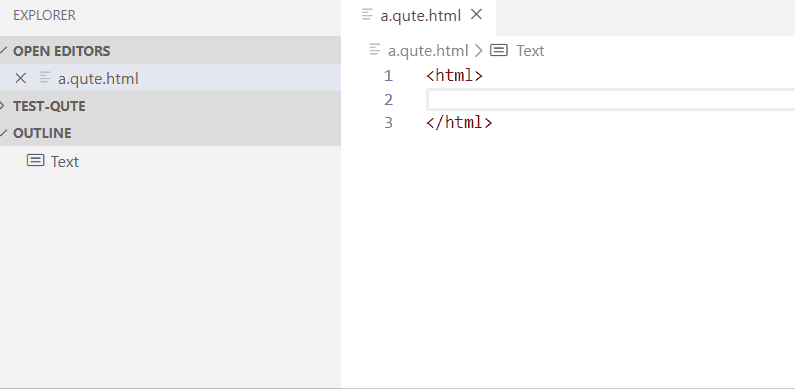
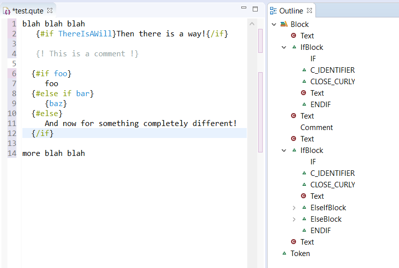

# qute-ls

POC for Qute Language Server based on [Qute parser generated by JavaCC21](https://github.com/javacc21/blue-sky/tree/master/grammars/qute) to explore if (https://github.com/javacc21) could be a good canditate to manage Qute parser with fault tolerant which is required for LSP. 

This repository hosts the following projects:

 * [com.redhat.qute.ls](https://github.com/angelozerr/qute-ls/tree/master/com.redhat.qute.ls) the Qute Language Server which consumes the Qute Parser generated by JavaCC21.
 * [vscode-qute](https://github.com/angelozerr/qute-ls/tree/master/vscode-qute) the vscode extension which consumes the Qute Language Server.
 * [vscode-qute](https://github.com/angelozerr/qute-ls/tree/master/com.redhat.qute.lsp4e) the Eclipse plugin based on LSP4E which consumes the Qute Language Server.

Today the Qute parser is not tolerant (when you write error in the template, the outline become empty), but it will be improved.

Here a demo with vscode which shows errors and outline (symbols) which shows the Qute AST:

 

Here a screenshot with Eclipse IDE:

